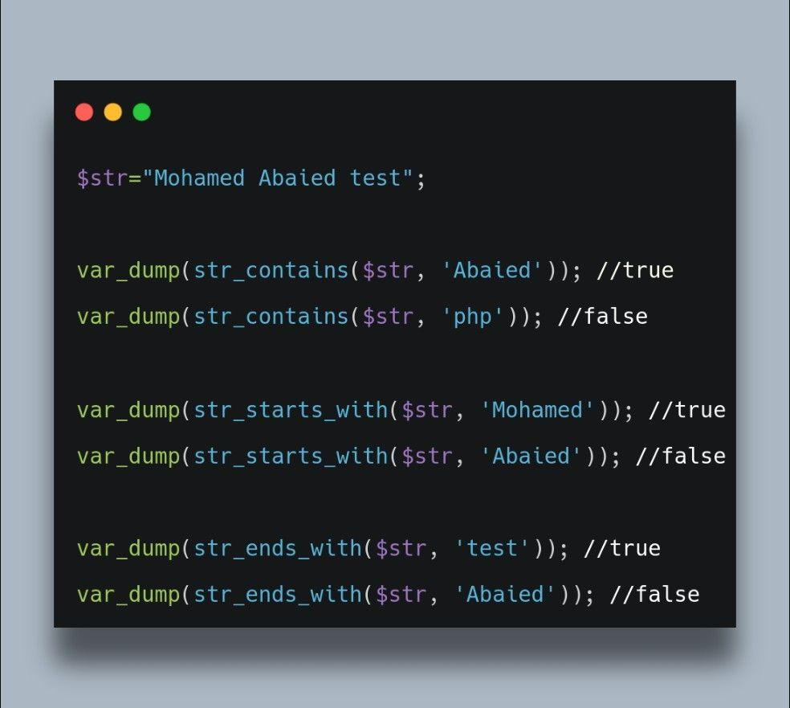
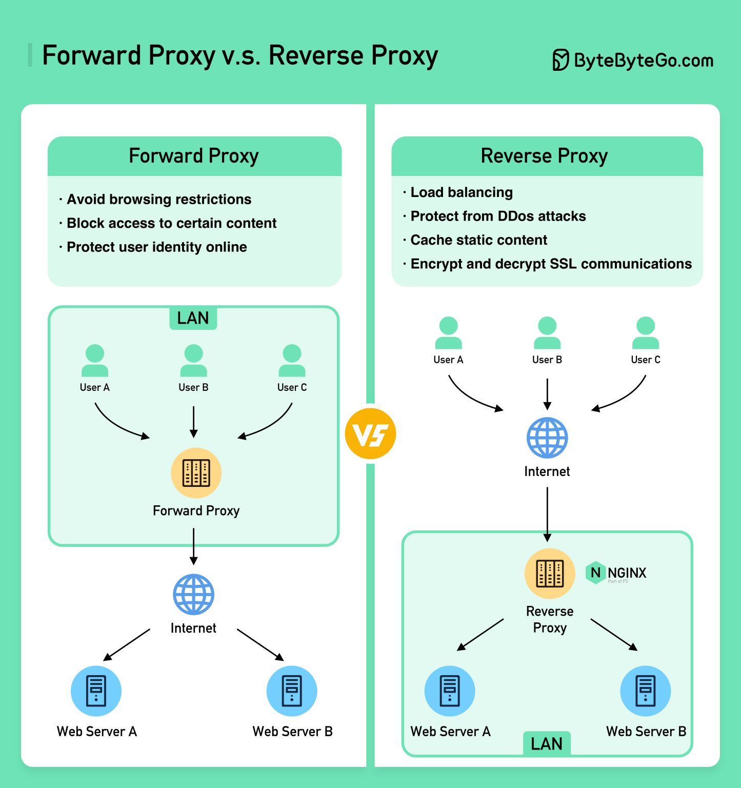

# Resources

- https://getcomposer.org/doc/articles/scripts.md#command-events  - Composer Command Events

```
"scripts": {
        "post-install-cmd": "execute a command here", # occurs after the install command has been executed with a lock file present.
        "post-update-cmd": "cghooks update", # occurs after the update command has been executed, or after the install command has been executed without a lock file present.
        ...
    },
```   

- https://packagist.org/packages/tracy/tracy - Debugger

- https://packagist.org/packages/fzaninotto/faker - Fake data generator

- https://packagist.org/packages/brainmaestro/composer-git-hooks - Git hooks in your composer config
- - https://git-scm.com/docs/githooks
- - Run `composer update` to update hooks if modify

- https://packagist.org/packages/dompdf/dompdf - DOM pdf

- https://packagist.org/packages/nategood/httpful - PHP HTTP Client

- https://packagist.org/packages/squizlabs/php_codesniffer - CodeSniffer
- - https://github.com/squizlabs/PHP_CodeSniffer/wiki/Reporting - Reporting
- - http://manpages.ubuntu.com/manpages/bionic/man1/phpcs.1.html - Manual
- - Use `dos2unix <file_name>` : Convert DOS file to UNIX format
- - Run `vendor/bin/phpcs <file_name>` and get errors
- - E.g `phpcs --report=code $(ls *.php) > file.txt`

- `composer require league/fractal` - (https://fractal.thephpleague.com/)
- <URL>/fractal.php

- https://craig.is/writing/chrome-logger (Debugging server side applications in the Chrome console.)
- https://github.com/ccampbell/chromephp (Chrome)
- Activate **Chrome Logger** in chrome web browser to see debugging codes in console.
 
# Set Up - docker version

- Clone docker branch (Dockerize the environment)
- GOTO `src`
- Clone master branch (Source Code)

# Notes

- `image-file.php` - never execute in browser, used as a template and rendered dynamically in `index.php`
- PHPCS
- - Exec in terminal `./phpcs/bin.sh`
- - Create `phpcs/report.txt` -> `phpcs/index.html` (HTML report)
- Git Hooks in `composer.json` on commit changes

#  Script to combine HTML/CSS into inline styles

- https://packagist.org/packages/tijsverkoyen/css-to-inline-styles
- Install `composer require tijsverkoyen/css-to-inline-styles`
- HTML page
```
<html>
<head>
    <meta charset="utf-8">
    <title>FX</title>
    <link rel="icon" href="https://phpsandbox.io/assets/img/brand/phpsandbox.png">
    <link href="https://fonts.googleapis.com/css2?family=Jost:ital,wght@0,400;0,500;0,531;0,600;0,700;0,800;0,900;1,400;1,500;1,531;1,600;1,700;1,800;1,900&amp;display=swap" rel="stylesheet">
</head>
<body>
<div class="h-screen bg-white flex items-center justify-center font-sans text-gray-700" style="font-family: 'Jost', sans-serif">
    <div class="font-medium items-center text-center flex flex-col justify-center h-full">
        <div class="flex flex-col justify-center items-center">
            

            <h1 style="font-size: 2rem;" class="text-gray-700">fadilxcoder 🎉</h1>

            <p class="mb-6 font-semibold">Design, Develop, Deploy !</p>

            <div class="p-2 bg-indigo-800 text-white rounded">fadil@xcoder.dvlpr</div>
        </div>
    </div>
</div>
</body>
</html>
```

- PHP script
```
require 'vendor/autoload.php';

use TijsVerkoyen\CssToInlineStyles\CssToInlineStyles;

// create instance
$cssToInlineStyles = new CssToInlineStyles();

$html = file_get_contents(__DIR__ . '/html-page.html');
$css = file_get_contents("https://unpkg.com/tailwindcss@^1.0/dist/tailwind.min.css");

// output

echo $cssToInlineStyles->convert(
    $html,
    $css
);

```

# Git hook

- `.git\hooks\pre-commit`

```bash
#!/bin/bash

echo committing as $(git config user.name)
#./vendor/bin/phpcs --report=code $(ls *.php) > ./phpcs/report.txt
#./phpcs/bin.sh

```

# Selenium - Automated testing

- Download driver : https://chromedriver.chromium.org/downloads (*Chrome version 110*)
- Launch chrome driver : `./chromedriver.exe --port=4444`
- GIT repo : https://github.com/php-webdriver/php-webdriver
- Download JAR : https://www.selenium.dev/downloads/ (*Latest stable version 4.8.0*)
- CLI : `java -jar selenium-server-4.8.0.jar`
- GOTO : http://localhost/packagist/selenium

# Addons.
<hr>

<hr>
